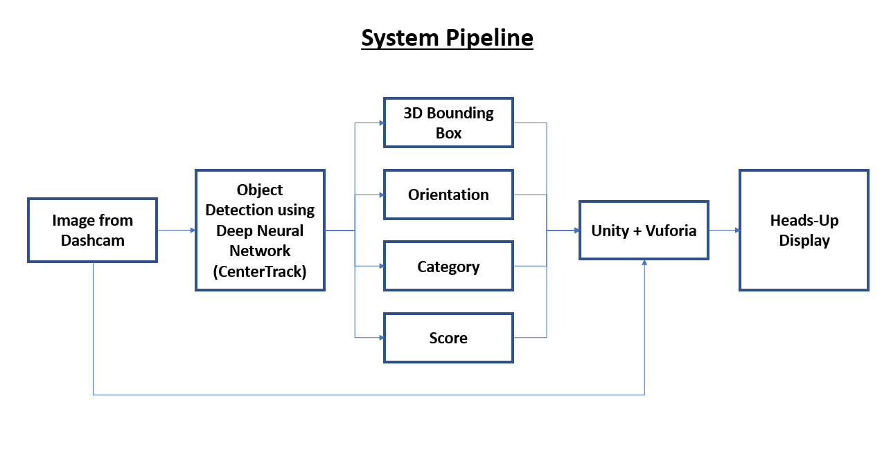

# Object Detection And Augmented Reality

The goal of this project is to come up with a prototype of a **Driver Assistance System** which can take images from an onboard Dashcam, detect nearby obstacles (such as other cars, pedestrians, cyclist/motorist, potholes, animals etc.) and display this information to driver on a Heads-up Display using Augmented Reality.

This is achieved through fthe ollowing pipeline -

Dashcam provides images to CenterTrack (Xingyi Zhou et.al.), which is a Deep Convolutional Neural Network that regresses on object's 6D-Pose (3D Bounding Box, Orientation), Category, and Score. A neural network which can regress on 6D-Pose rather than usual 2D bounding box was necessary for Augmented Reality (AR). CenterTrack was trained using Carla Simulator, which is an open source platform for training Autonomous Vehicles. For rendering virtual objects into real scene, Unity was used. Since Unity primarily supports Android, iOS  & UWP, rendering virutal objects from images based on dashcam required using Vuforia Engine, as it gives the flexibility to attach an External Camera & Pose Sensor for displaying information on heads-up display.

This repository is a prototype or better stated 'a likely plan of action for actual buisness use case'. It implements following steps :-

1. Provides a framework for 3D Object Detection (see directory DDDCenterTrack). This is used for categories like Cars, Pedestrians, Cyclist etc. for which 3D Bounding Box data is available.
2. Provides a framework for 2D Object Detection (see directory DDDetectorn). This is used for categories like Animals, Potholes, for which 3D-Pose data is hardly available.
3. Code that trains CenterTrack via Carla Simulator (see directory Carla). 
4. Unity scripts which implements rendering of virtual objects.

For actual buisness use case, following things should be kept in mind :-
1. Implement custom Vuforia plugin for device which is providing images (ex. Dashcam).
2. Heads-up display implementation.
